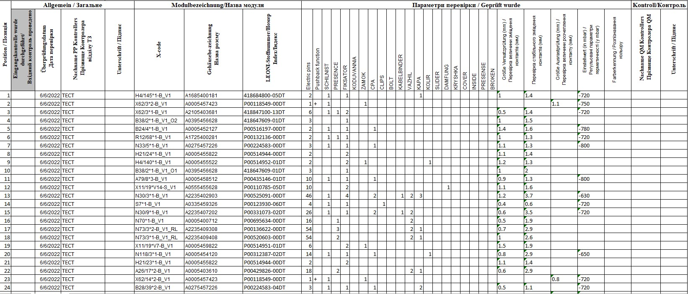
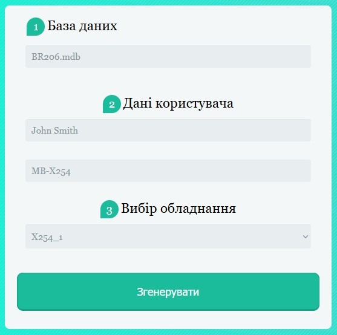

This application was made for quickly generating documentation of test equipment based on information from TSK CSWIN database
The application can make .xlsx document based .mdb database for the equipment specified by user

The application is made for automotive industry and actively used on Leoni AG in Kolomyia



The generated document will look in accordance with the standards



The code require compilation by using NodeJs 14

Download the project and run scripts:
```
npm i
npm build
```
